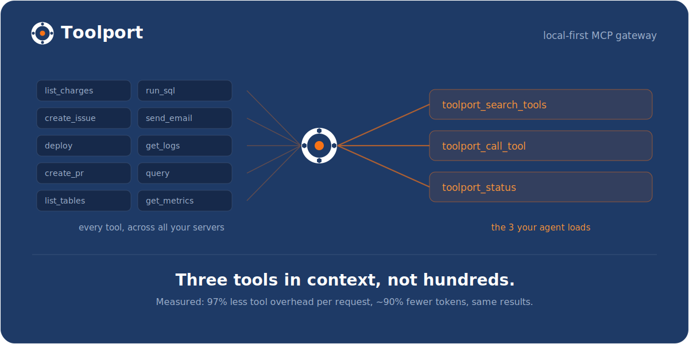
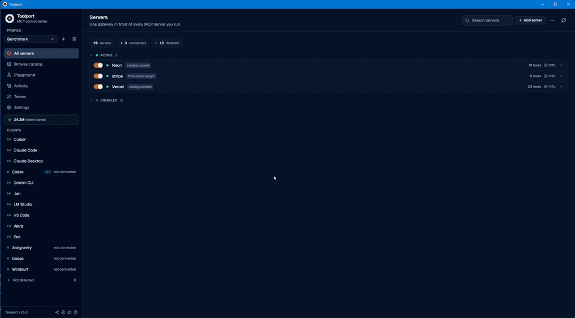
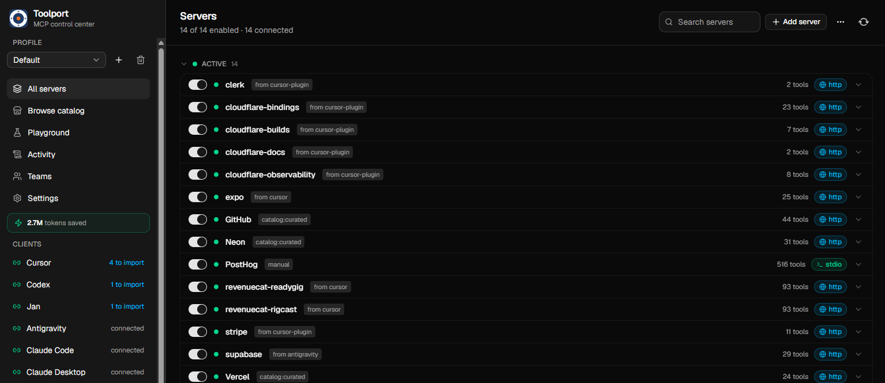

<div align="center">

# Toolport

**Every tool. One port.** One local gateway for all your MCP servers, shared by
every AI client, with far fewer tokens.

[](https://github.com/tsouth89/toolport/actions/workflows/ci.yml)
[](https://github.com/tsouth89/toolport/releases)
[](LICENSE)
[](https://discord.gg/Xsn27MxdBA)

</div>





Toolport is a local MCP (Model Context Protocol) gateway. You set up and
authenticate each server once, and every AI client (Claude, Cursor, Codex, and
the rest) points at Toolport and shares them, so you stop configuring the same
servers separately in each app.

<p align="center">
  
</p>

It also fixes what those servers cost your agent. Every MCP server you connect
dumps all of its tools into context on every single request, and it adds up fast:
just 3 servers (62 tools) cost ~24,000 tokens of definitions before you've asked
anything. Toolport advertises a handful of compact meta-tools the agent searches
on demand instead, so it pays ~900 tokens (96% less, measured).

**Measured on a frontier model: up to 91% fewer total tokens at the same task
success** (graded for correct answers, not just completion), plus 96% less
tool-definition overhead on every request, rising to 99.5% on a real 415-tool
catalog (see [BENCHMARK.md](BENCHMARK.md)). That holds whether you run one AI tool
or five, on cloud models (where tokens are your bill) or local ones (where tool defs
eat your context window).

|                                                                                             |                                                                              |                                                                                                |
| :-----------------------------------------------------------------------------------------: | :--------------------------------------------------------------------------: | :--------------------------------------------------------------------------------------------: |
|                |                     |  |
| **Fewer tokens** - lazy discovery keeps context flat no matter how many servers you connect | **One config, every client** - set up a server once, every AI tool shares it |         **Supply-chain security** - rug-pull and tool-poisoning detection on the path          |

## Why

Every MCP server you connect dumps its full tool list into your agent's context on
every request, and most AI clients also want their own separate configuration. So you
pay a token tax on every call and reconfigure the same servers in every app. Toolport
fixes both.

### Fewer tokens

- **~90% fewer tokens.** In lazy-discovery mode the gateway advertises four compact
  meta-tools (`toolport_status`, `toolport_search_tools`, `toolport_call_tool`,
  `toolport_fetch_result`) instead of the full catalog, and the agent searches and
  calls on demand, so context stays flat no matter how many servers you connect.
  (A couple more appear only when you turn the matching feature on: `toolport_confirm`
  with approvals, enable/disable with agent control.) Benchmarked, graded for correct answers: up to 91% fewer
  total tokens at the same task success, 96% less tool-definition overhead per request,
  99.5% at a real 415-tool catalog ([BENCHMARK.md](BENCHMARK.md)). Ask `toolport_status`
  for what it has saved you so far.
- **Search by intent, not just keywords.** `toolport_search_tools` ranks by relevance
  across every server, and no tool is ever hidden, any server's full set is one call
  away. Optional semantic re-ranking (a local or hosted embeddings endpoint) surfaces
  paraphrased needs like "charge a card"; off by default, pure lexical otherwise.

### One setup, every client

- **Set up once, use everywhere.** Each client points at one gateway. Add and
  authenticate a server a single time and it appears in every client.
- **Paste from any client's docs.** Copy a server config snippet straight from
  an MCP server's installation instructions (Cursor JSON, Codex TOML, VS Code,
  Zed, Claude Code CLI, or any other supported client) and paste it into the Add
  Server dialog. Toolport auto-detects the format and pre-fills the fields,
  including environment variable values.
- **Per-agent scoping.** Give each client only the servers it should see. A coding
  agent literally cannot call a billing tool that isn't in its profile.
- **Obvious auth.** OAuth or API key, stored once in the OS keychain, a single click per
  server. Newly-authed servers propagate to connected clients without a restart.
- **No secrets in client configs.** Clients only ever say "talk to Toolport." Keys live
  in the OS keychain and are injected at runtime.
- **A catalog to grow.** Add popular servers from a curated list of 40+, or search the
  official MCP Registry, then authenticate through the same flow.

### Security, because the gateway is on the path

- **Tool integrity (rug-pull + poisoning detection).** Toolport fingerprints each tool
  when you connect a server and flags it if the definition later changes or a server
  quietly adds one (a "rug pull"), or if a description or schema carries injection-like
  content ("tool poisoning"). Detection only, on by default, entirely local.
- **Content defense (anti-agentjacking).** When a tool _returns_ untrusted content (a
  Sentry error, a web page, an issue body) with injection-like instructions, Toolport
  flags it and marks it as external data, not instructions, the separation that blunts
  indirect prompt injection. Never blocks, on by default.
- **Human-in-the-loop approvals.** Turn on approval mode and destructive tool calls
  pause until you approve or deny them in the app, with an OS notification when a
  call is waiting. Deny actually blocks the call; the agent just sees a declined
  tool call. Your agent asks before it drops the table.
- **Governance and audit.** Toggle any tool on or off, or hide every destructive tool
  from every client with one switch. Every call is recorded with per-server latency and
  error rates.

### Control and extras

- **Agent control, on your terms.** Optionally let an agent enable or disable servers
  through the gateway (`toolport_enable_server` / `toolport_disable_server`), reflected in
  the app live. Off by default, and the destructive-tool switch always stays yours.
- **Full MCP, not just tools.** Tools, resources, and prompts are all proxied.
- **Test before you wire it up.** A built-in playground invokes any tool with a form
  generated from its schema, so you can confirm a server works without configuring a
  client first.
- **Diagnostics in one click.** Bundles your version, OS, a secrets-stripped server
  summary, and the recent gateway log, ready to paste into a bug report.

## How it works

Toolport has two pieces:

1. **The desktop app** (Tauri + React) where you manage servers, profiles,
   credentials, and which clients are connected.
2. **The gateway binary** (`toolport-gateway`) that each AI client launches over
   stdio. It reads Toolport's registry, connects to the enabled downstream servers
   (stdio or remote HTTP/SSE), and routes tool calls to the right one. Tool names
   are namespaced per server (`stripe__list_charges`) so they never collide.

```
AI client (Cursor / Claude / Codex / Antigravity / ...)
        │  stdio MCP
        ▼
  toolport-gateway  ──reads──►  registry.json + OS keychain
        │  routes tools/calls
        ▼
  downstream MCP servers (Stripe, Supabase, GitHub, ...)
```

The registry is the shared source of truth; the gateway watches it and rebuilds
live, so toggles and new credentials take effect without restarting the client.
If a connected server changes its own tool set mid-session, Toolport picks that up
and refreshes too.

## Supported clients

Toolport auto-detects these **21 AI clients**, installs the gateway into each with one
click, and can import a client's existing servers. It writes the config file shown
below for you, so you never have to edit these by hand.

| Client         | Config file                                                                                | Format                   |
| -------------- | ------------------------------------------------------------------------------------------ | ------------------------ |
| Claude Desktop | `<config>/Claude/claude_desktop_config.json`                                               | JSON (`mcpServers`)      |
| Claude Code    | `~/.claude.json`                                                                           | JSON (`mcpServers`)      |
| Cursor         | `~/.cursor/mcp.json`                                                                       | JSON (`mcpServers`)      |
| VS Code        | `<config>/Code/User/mcp.json`                                                              | JSON (`servers`)         |
| Windsurf       | `~/.codeium/windsurf/mcp_config.json`                                                      | JSON (`mcpServers`)      |
| Codex          | `~/.codex/config.toml`                                                                     | TOML (`mcp_servers`)     |
| Continue       | `~/.continue/config.yaml`                                                                  | YAML (`mcpServers`)      |
| Antigravity    | `~/.gemini/config/mcp_config.json`                                                         | JSON (`mcpServers`)      |
| Gemini CLI     | `~/.gemini/settings.json`                                                                  | JSON (`mcpServers`)      |
| Cline          | `<config>/Code/User/globalStorage/saoudrizwan.claude-dev/settings/cline_mcp_settings.json` | JSON (`mcpServers`)      |
| Roo Code       | `<config>/Code/User/globalStorage/rooveterinaryinc.roo-cline/settings/mcp_settings.json`   | JSON (`mcpServers`)      |
| Warp           | `~/.warp/.mcp.json`                                                                        | JSON (`mcpServers`)      |
| Amazon Q       | `~/.aws/amazonq/mcp.json`                                                                  | JSON (`mcpServers`)      |
| Kiro           | `~/.kiro/settings/mcp.json`                                                                | JSON (`mcpServers`)      |
| Zed            | `~/.config/zed/settings.json`                                                              | JSON (`context_servers`) |
| LM Studio      | `~/.lmstudio/mcp.json`                                                                     | JSON (`mcpServers`)      |
| Jan            | `<data>/Jan/data/mcp_config.json`                                                          | JSON (`mcpServers`)      |
| BoltAI         | `~/.boltai/mcp.json`                                                                       | JSON (`mcpServers`)      |
| Pi             | `~/.pi/agent/mcp.json`                                                                     | JSON (`mcpServers`)      |
| Goose          | `~/.config/goose/config.yaml`                                                              | YAML (`extensions`)      |
| Hermes         | `~/.hermes/config.yaml`                                                                    | YAML (`mcp_servers`)     |

`<config>` is your OS application-config dir (`%APPDATA%` on Windows, `~/Library/Application Support` on macOS, `~/.config` on Linux); `<data>` is the data dir (`~/.local/share` on Linux, the same as `<config>` elsewhere). Zed and Goose paths vary slightly by OS; Toolport resolves the right one automatically.

### Codex setup walkthrough

Use this when Codex has already created its `~/.codex/` directory.

1. In Toolport, add or enable the MCP servers you want Codex to use.
2. Open **Clients**, select **Codex**, optionally choose a profile, and click **Connect to Toolport**.
3. Toolport updates `~/.codex/config.toml` with a single `[mcp_servers.conduit]` entry. That entry runs the resolved `toolport-gateway` binary; existing Codex TOML keys and other MCP servers are preserved, and an existing config is backed up before the write.
4. Start a new Codex session so it re-reads the config. In Toolport, the Codex row changes to **connected to Toolport**; in Codex, Toolport-managed tools are served through the one `conduit` MCP server. With lazy discovery enabled, Codex gets Toolport's compact search tools instead of every downstream tool up front.

Gotcha: when running Toolport from source, build the gateway first with `npm run build:gateway`. The desktop dev server does not build the separate binary that Codex spawns, so Codex will report the gateway as missing until that binary exists.

### Open WebUI and other HTTP/OpenAPI consumers

The gateway speaks HTTP/OpenAPI natively, so Open WebUI (and any OpenAPI tool
client) connects straight to Toolport, no bridge or proxy. Flip on **Settings ->
Integrations -> Open WebUI / HTTP endpoint** in the app (or run
`toolport-gateway --http 8765`), then add `http://localhost:8765` as an OpenAPI
tool server. See [docs/openwebui.md](docs/openwebui.md). The same endpoint serves
any HTTP/OpenAPI MCP consumer (n8n, LibreChat, custom agents).

## Configuration

Lazy discovery, the destructive-tool block, and agent control are global settings,
stored in the registry and toggled in the app's Settings view, so they apply to every
client (lazy discovery is on by default). Per-client behavior is set via env vars on the
gateway entry, written for you when you connect a client:

- `CONDUIT_PROFILE=<name>` - scope this client to one profile's servers. Unset =
  the active profile.
- `CONDUIT_DISCOVERY=lazy|full` - optional per-client override of the global lazy
  setting. Rarely needed; the gateway reads the registry default otherwise.
- `CONDUIT_REGISTRY=<path>` - override the registry file location. Defaults to a
  stable per-user path so packaged and unpackaged clients agree.
- `CONDUIT_RESULT_BUDGET=<bytes>` - cap oversized tool results at this many bytes
  (0 disables it). Optional; off by default.
- `CONDUIT_HTTP=<port>` (with optional `CONDUIT_HTTP_HOST`, default `127.0.0.1`,
  and `CONDUIT_HTTP_TOKEN` for the required bearer token) - run the gateway in
  HTTP/OpenAPI mode instead of stdio, for Open WebUI and other OpenAPI clients (see
  above). The in-app Settings -> Integrations toggle sets these for you, and the
  gateway refuses a non-loopback bind without a token.

**Semantic search (optional).** Lazy discovery ranks tools lexically by default. Point it
at any `/v1/embeddings` endpoint (LM Studio, Ollama, or a cloud provider) to blend in
embedding similarity for paraphrased queries: `CONDUIT_SEMANTIC=on`,
`CONDUIT_EMBED_ENDPOINT`, `CONDUIT_EMBED_MODEL`, plus optional `CONDUIT_EMBED_KEY`
(endpoint auth) and `CONDUIT_EMBED_BLEND`.

**Multiple accounts for the same service.** Credentials belong to a server, not a
profile. To use, say, a work and a personal GitHub, add GitHub twice as two
servers ("GitHub (work)", "GitHub (personal)"), authenticate each with its own
account, and enable one in each profile. A client scoped to the work profile
(`CONDUIT_PROFILE`) then only ever sees the work account. Tool names are
namespaced per server, so the two never collide even in the same profile.

## Install

Prebuilt installers are published on the
[Releases](https://github.com/tsouth89/toolport/releases) page. Toolport runs on
**Windows, macOS, and Linux** (Windows and macOS builds are code-signed; macOS is
also notarized). On Linux, prefer the **`.deb`** (it links your system's WebKitGTK and is
the most reliable package); the **AppImage** is a portable, no-root fallback but
can clash with very new or virtualized graphics stacks (see Troubleshooting). To
run from source, see Development below.

Both the **Windows** and **macOS** installers are code-signed (macOS is also
notarized). macOS installs cleanly through Gatekeeper. On Windows the installer is
signed with your validated publisher name (no "unknown publisher"), but because it
uses a standard certificate rather than EV, SmartScreen reputation still builds with
downloads, so an early install may still show "Windows protected your PC", click
**More info -> Run anyway** to continue. The **Linux** packages are unsigned, as is
typical. See [docs/SIGNING.md](docs/SIGNING.md) for details.

**Updating and uninstalling on Linux.** There is no graphical uninstaller, use the
terminal. The package name is `toolport`.

```bash
# Update to a newer version: just install the new .deb, it upgrades in place.
sudo apt install ./Toolport_1.0.0_amd64.deb

# Uninstall (keeps your config + saved secrets).
sudo apt remove toolport

# Uninstall and wipe app config too (secrets in the keyring stay).
sudo apt purge toolport
```

If you used the **AppImage**, there's nothing to uninstall, just delete the
`.AppImage` file. (On Windows use Add or Remove Programs; on macOS drag
**Toolport.app** to the Trash.)

## Development

Requires Node and the Rust toolchain.

```bash
npm install
npm run tauri dev      # run the desktop app
```

Other useful commands:

```bash
cargo test --manifest-path src-tauri/Cargo.toml   # Rust unit tests (lib + gateway)

# Build the gateway binary. Required when running from source: AI clients spawn
# this binary directly, so without it a connected client reports "not found".
# (Packaged releases bundle it, so installed users never need this.)
npm run build:gateway

# Build a Windows installer (NSIS) with the gateway bundled.
npm run tauri:bundle
```

The frontend is typechecked with `npx tsc --noEmit`.

## Troubleshooting

- **OAuth opens a blank page (macOS).** The OAuth flow redirects back to a local
  `http://127.0.0.1` callback. Safari can silently block that redirect, so the
  sign-in page renders blank. Set **Chrome or Brave** as your default browser (or
  paste an access token instead). Complete one attempt at a time, an abandoned
  attempt keeps the callback port reserved for a few minutes and can cause a
  "state mismatch" on the next try.
- **A client reports the gateway "was not found" (running from source).** Build
  the gateway binary once: `cd src-tauri && cargo build --bin toolport-gateway`.
  `npm run tauri dev` builds the app but not this separate binary; packaged
  releases bundle it, so installed users never hit this.
- **Repeated macOS keychain prompts / "could not read secret from the keychain"
  in dev.** An unsigned dev build gets an unstable code-signing identity, so the
  keychain re-prompts or denies reads. Signed release builds (v0.9.3+) don't: they
  store secrets in the macOS data-protection keychain under a shared access group,
  so the gateway reads them with no prompt. This is a dev-only artifact.
- **"could not read/store secret" on Linux.** Secret storage uses the freedesktop
  Secret Service (libsecret), provided by GNOME Keyring, KWallet, or similar. A
  headless box or a session without a running keyring daemon has nowhere to store
  secrets. Run Toolport in a desktop session, or install and unlock a keyring
  (e.g. `gnome-keyring`).
- **macOS keychain and the gateway (v0.9.3+).** The app and the separately-signed
  gateway share a team-scoped keychain access group, so the gateway reads the
  secrets the app saved with no prompt, even across app updates. (Earlier releases
  showed a one-time "Always Allow" prompt; on current signed builds it's gone.)
- **VS Code: the `conduit` server doesn't start automatically.** VS Code may require
  you to click **Start Server** on the `conduit` MCP entry the first time, that's VS
  Code's own MCP handling, not Toolport. After that it reconnects on its own.
- **Linux: the AppImage won't launch / no window (`EGL_BAD_PARAMETER`).** The
  AppImage bundles its own libraries, which can clash with a very new or
  virtualized graphics stack (e.g. VMware's `vmwgfx` driver, where the default EGL
  display fails). **Use the `.deb` instead**, it links your system's WebKitGTK and
  is the more reliable Linux package. If you must use the AppImage, try
  `EGL_PLATFORM=surfaceless ./Toolport_*.AppImage`, or in a VM enable 3D
  acceleration. (This is a packaging/GPU issue, not a Toolport bug; the `.deb` works
  where the AppImage doesn't.)

## Status

Toolport is in active development. Working end to end: the
gateway, lazy discovery, per-agent scoping, OAuth/key auth with live propagation,
the catalog, client import/migrate, per-tool and destructive-tool governance, the
human approval queue, a global Settings view, tool-integrity and content-defense
detection, an audit log with latency/error stats, resources + prompts proxying, and
a tool playground. See
[docs/ROADMAP.md](docs/ROADMAP.md) for what is done and planned.

## Known issues

- **Linux only, glib `VariantStrIter` soundness ([RUSTSEC-2024-0429](https://rustsec.org/advisories/RUSTSEC-2024-0429)).**
  Tauri's Linux webview stack pulls in `glib` 0.18 transitively (`wry → webkit2gtk →
gtk 0.18 → glib 0.18`). The fix only exists in `glib` 0.20+, and the gtk-0.18
  binding line, which is what Tauri 2 uses on Linux, hard-pins `glib = "^0.18"`, so
  the patched release cannot be selected without moving the whole webview stack. The
  bug is a soundness/null-deref crash (not remote code execution), is confined to the
  webview binding layer (Toolport never calls `VariantStrIter`), and does not affect
  the Windows or macOS builds. We are tracking the upstream move to a glib-0.20 stack
  and will apply a `[patch.crates-io]` backport if Linux crashes surface before then.

## Toolport Teams

Want one shared, governed MCP server set across your whole team? **Toolport Teams** lets
an admin define the team's servers once, every member's Toolport syncs them, and each
member's keys still never leave their own machine.

Run it whichever way you prefer:

- **Hosted:** sign in at [toolport.app/teams](https://toolport.app/teams) and invite your
  team, no infrastructure to run.
- **Self-hosted:** one Docker command (`docker pull ghcr.io/tsouth89/conduit-teams`).

Same pricing hosted or self-hosted:

- **Free for up to 5 people**: one shared server set, the safety policy, and a
  30-day exportable audit trail.
- **Team, $39/month for up to 5 people, then $12/person**: adds per-server access
  control, roles, spend budgets, full audit history, and Slack/Discord/Teams alerts.
- Either way, each member's keys stay on their own machine, and local-command servers
  are per-member opt-in (a team config can never silently run code on a member's
  machine).

Pricing, the self-host quickstart, and checkout are all at
**[toolport.app/teams](https://toolport.app/teams)**.

## License

[MIT](LICENSE), and the local app and gateway always will be. Toolport follows an
open-core model: the desktop app and `toolport-gateway` are free and open source, and
Toolport Teams (above) funds the free app. Anything you contribute here is MIT and
benefits everyone, see [CONTRIBUTING.md](CONTRIBUTING.md).
