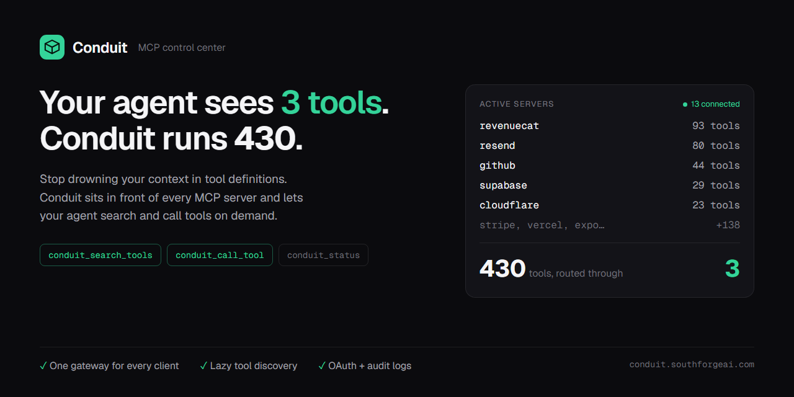

# Conduit

**One gateway for all your MCP servers, across every AI agent.**




Conduit is a local MCP (Model Context Protocol) gateway and manager. You set up
and authenticate each MCP server once in Conduit, point your AI agents at the
single Conduit gateway, and every server is instantly available in all of them.
No more configuring the same servers separately in Cursor, Claude, Codex, and
the rest.

Built for people who use more than one AI coding tool and are tired of managing
MCP servers per app.

## Screenshots

| Servers | Activity | Playground |
|---|---|---|
|  |  |  |

## Why

Every AI client wants its own MCP configuration. Run a handful of agents and you
end up configuring the same servers several times, re-authenticating in each, and
drowning every agent in hundreds of tool definitions. Conduit fixes that:

- **Set up once, use everywhere.** Each client points at one Conduit gateway.
  Add a server and authenticate it a single time; it appears in every client.
- **Small context, not hundreds of tools.** In lazy-discovery mode the gateway
  advertises three meta-tools (`conduit_status`, `conduit_search_tools`,
  `conduit_call_tool`) instead of the full catalog. The agent searches and calls
  on demand, so context stays flat no matter how many servers you connect.
- **Per-agent scoping.** Give each client only the servers it should see. A
  coding agent literally cannot call a billing tool that is not in its profile.
- **Obvious auth.** OAuth or API key, stored once in the OS keychain. Status is
  shown per server; a single click authenticates. Newly-authed servers propagate
  to connected clients without a restart.
- **A catalog to grow.** Add popular servers from a curated list or search the
  official MCP Registry, then authenticate through the same flow.
- **No secrets in client configs.** Clients only ever say "talk to Conduit." Keys
  live in the OS keychain and are injected at runtime.
- **Governance built in.** Toggle any tool on or off, or flip one switch to hide
  every destructive tool from every client at once. Every tool call is recorded
  in an audit log, with per-server latency and error rates.
- **Full MCP, not just tools.** Tools, resources, and prompts are all proxied.
- **Test before you wire it up.** A built-in playground invokes any tool with a
  form generated from its schema, so you can confirm a server works without
  configuring a client first.

## How it works

Conduit has two pieces:

1. **The desktop app** (Tauri + React) where you manage servers, profiles,
   credentials, and which clients are connected.
2. **The gateway binary** (`conduit-gateway`) that each AI client launches over
   stdio. It reads Conduit's registry, connects to the enabled downstream servers
   (stdio or remote HTTP/SSE), and routes tool calls to the right one. Tool names
   are namespaced per server (`stripe__list_charges`) so they never collide.

```
AI client (Cursor / Claude / Codex / Antigravity / ...)
        │  stdio MCP
        ▼
  conduit-gateway  ──reads──►  registry.json + OS keychain
        │  routes tools/calls
        ▼
  downstream MCP servers (Stripe, Supabase, GitHub, ...)
```

The registry is the shared source of truth; the gateway watches it and rebuilds
live, so toggles and new credentials take effect without restarting the client.

## Supported clients

Cursor, Claude Desktop, Claude Code, Codex, Google Antigravity, VS Code,
Windsurf, Gemini CLI, Cline, Roo Code. Conduit detects each one, installs the
gateway with one click, and can import a client's existing servers.

## Configuration

Lazy discovery and the destructive-tool policy are global settings, stored in the
registry and toggled in the app, so they apply to every client (lazy discovery is
on by default). Per-client behavior is set via env vars on the gateway entry,
written for you when you connect a client:

- `CONDUIT_PROFILE=<name>` - scope this client to one profile's servers. Unset =
  the active profile.
- `CONDUIT_DISCOVERY=lazy|full` - optional per-client override of the global lazy
  setting. Rarely needed; the gateway reads the registry default otherwise.
- `CONDUIT_REGISTRY=<path>` - override the registry file location. Defaults to a
  stable per-user path so packaged and unpackaged clients agree.

## Install

Prebuilt installers are published on the
[Releases](https://github.com/tsouth89/conduit/releases) page. Conduit runs on
**Windows and macOS** (the macOS build is signed and notarized), with **Linux**
(.deb and AppImage) in beta. To run from source, see Development below.

The installer is not yet code signed. On **Windows**, SmartScreen may show
"Windows protected your PC", click **More info → Run anyway**. On **macOS**,
Gatekeeper may say the app "is damaged" or cannot be opened; right-click the app
and choose **Open**, or run `xattr -dr com.apple.quarantine /Applications/Conduit.app`.
See [docs/SIGNING.md](docs/SIGNING.md) for the signing plan.

## Development

Requires Node and the Rust toolchain.

```bash
npm install
npm run tauri dev      # run the desktop app
```

Other useful commands:

```bash
cargo test --manifest-path src-tauri/Cargo.toml   # Rust unit tests (lib + gateway)

# Build the gateway binary. Required when running from source: AI clients spawn
# this binary directly, so without it a connected client reports "not found".
# (Packaged releases bundle it, so installed users never need this.)
npm run build:gateway

# Build a Windows installer (NSIS) with the gateway bundled.
npm run tauri:bundle
```

The frontend is typechecked with `npx tsc --noEmit`.

## Troubleshooting

- **OAuth opens a blank page (macOS).** The OAuth flow redirects back to a local
  `http://127.0.0.1` callback. Safari can silently block that redirect, so the
  sign-in page renders blank. Set **Chrome or Brave** as your default browser (or
  paste an access token instead). Complete one attempt at a time, an abandoned
  attempt keeps the callback port reserved for a few minutes and can cause a
  "state mismatch" on the next try.
- **A client reports the gateway "was not found" (running from source).** Build
  the gateway binary once: `cd src-tauri && cargo build --bin conduit-gateway`.
  `npm run tauri dev` builds the app but not this separate binary; packaged
  releases bundle it, so installed users never hit this.
- **Repeated macOS keychain prompts / "could not read secret from the keychain"
  in dev.** An unsigned dev build gets an unstable code-signing identity, so the
  keychain re-prompts or denies reads. A signed release fixes this; it is a
  dev-only artifact.
- **"could not read/store secret" on Linux.** Secret storage uses the freedesktop
  Secret Service (libsecret), provided by GNOME Keyring, KWallet, or similar. A
  headless box or a session without a running keyring daemon has nowhere to store
  secrets. Run Conduit in a desktop session, or install and unlock a keyring
  (e.g. `gnome-keyring`).

## Status

Conduit is in active development. Working end to end: the
gateway, lazy discovery, per-agent scoping, OAuth/key auth with live propagation,
the catalog, client import/migrate, per-tool and destructive-tool governance, an
audit log with latency/error stats, resources + prompts proxying, and a tool
playground. See [docs/ROADMAP.md](docs/ROADMAP.md) for what is done and planned.

## Known issues

- **Linux only, glib `VariantStrIter` soundness ([RUSTSEC-2024-0429](https://rustsec.org/advisories/RUSTSEC-2024-0429)).**
  Tauri's Linux webview stack pulls in `glib` 0.18 transitively (`wry → webkit2gtk →
  gtk 0.18 → glib 0.18`). The fix only exists in `glib` 0.20+, and the gtk-0.18
  binding line, which is what Tauri 2 uses on Linux, hard-pins `glib = "^0.18"`, so
  the patched release cannot be selected without moving the whole webview stack. The
  bug is a soundness/null-deref crash (not remote code execution), is confined to the
  webview binding layer (Conduit never calls `VariantStrIter`), and does not affect
  the Windows or macOS builds. We are tracking the upstream move to a glib-0.20 stack
  and will apply a `[patch.crates-io]` backport if Linux crashes surface before then.

## License

[MIT](LICENSE). The gateway and local manager are free and open source under an
open-core model; planned team/enterprise features (shared/hosted gateway,
RBAC/SSO, policy, audit export, secret-vault integrations) are a separate paid
layer.
